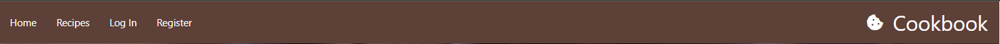
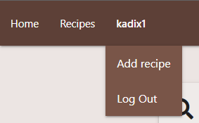
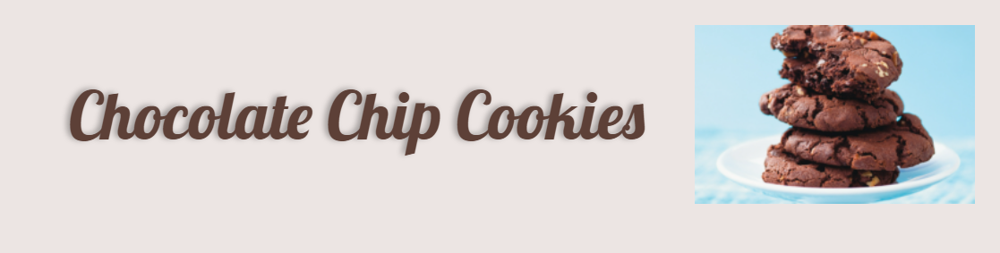
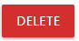
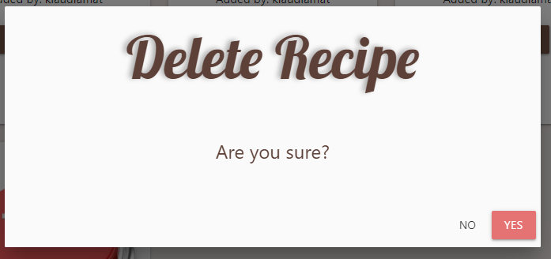

# Cookbook - online recipes for delicious sweets!

The website is desgined to gather all people that loves baking delicious sweets. The focus of the website is to allow users to upload own recipes to share with others in this community. 


[View the live project here](https://cookbook-km.herokuapp.com/home)

# User Experience (UX)

## User Stories

+ First Time Visitor:
    + As a First Time Visitor, I can immediately understand the purpose of the webiste.
    + As a First Time Visitor, I can easily navigate the website to find content. 
    + As a First Time Visitor, I can view recipes and choose one to read.
    + As a First Time Visitor, I can search for the desire recipe.
    + As a First Time Visitor, I can register an account.

+ Returning Visitor:
    + As a Returning Visitor, I can log in.
    + As a Returning Visitor, I can log out.
    + As a Returning Visitor, I can create recipe so other can view it.
    + As a Returning Visitor, I can edit recipe to change any mistakes.
    + As a Returning Visitor, I can delete recipe.

+ Admin:
    + As a Admin, I can edit and delete all the recipes to maintain content of the page.

## Desgin


I choose main color of brown darken-2 (#5d4037) from materialize color palette and added lighter or darker tones to make sure that works well togheter on to the website. 

## Wireframes

I created wireframes in the Balsamiq program as first visual concept of the website.

Mobile wireframe - [PDF file here](documentation/mobile_wireframe.pdf)


Desktop wireframe - [PDF file here](documentation/desktop_wireframe.pdf)


# Database

## Data Types
The types of data stored in MongoDB are:
* ObjectId
* String
* Array
* Binary

## Collection Structure
In this case, I have modelled my relational database on a non-relational database system, MongoDB. I have used the MongoDB best practice and guidance taught on the course when migrating relational database platforms to non-relational database platforms as my guide in this case. I have used the following mapping example:


["How to Migrate Relational Database to MongoDB?: Made Easy", Raj Verma](https://hevodata.com/learn/author/raj-verma/)

A dedicated relational database platform like MySQL or PostgreSQL could also have been used in this case.

Cookbook relies on two database collections. 

### Users Collection
Password is entered as string, but stored as binary after encryption trough security werkzeug tool. To log in user - password from database is encrypted to check match with inserted data in the login form.


### Recipes Collection


# Features

## Navbar
+ The navigation bar style is consistent. It navigates user through the website. Main bar includes links to the Home, Recipes, Log in and Register page and Cookbook logo with cookie font awesome icon.

    

+ While user is logged in on the desktop view can see his username on the navbar. From it goes dropdown menu with two links: Add recipe and log out.

    

+ On the mobile devices whole menu transform to hamburger button with the dropdown menu.

    

    

## Hero Images
+ First hero image are chocolate muffins with blueberries and mint on the top. Image is very appealing and eencourage user to check recipes for sweets.

    

+ Second hero image is white cake with chocolate sauce on the top. It works well with whole website colour palette.

    

## Welcome Text

+ Big welcome text on the Cookbook website. There is a brief explanation the purpose of the website and that user can create an account to add recipes.

    

+ Mobile View

    

## Footer
+ Footer includes Font Awesome Icons that provides social media links to Twitter, YouTube and Discord. There is also developer's copyright.

    

## Search 
+ Search bar is located on the recipes page. You can search recipe by title or interested ingredients.

    

## Recipes Cards
+ Recipes are listed on the nice and tidy card tiles. One recipe card contain image, title, author and "SHOW RECIPE" button. If user is the author of the recipe, can also see buttons for editing and deleting it. 

    

+ Mobile View

    

## Recipe Title and Image
+ Recipe title and image is displayed while user select desire recipe.
+ On the desktop view Title is situated on the left and Image on the right.

    

+ On the mobile view both element taking whole content width. 

    

    

## GO BACK button
+ For better user experience there is also GO BACK button that redirect user to the recipes page from selected recipe content page. That means user don't need to select option from navbar.

    

## Login
+ On the login page user need to provide username and password that used during registration. There is redirecting button to registration page for the new user.
+ Desktop View

    

+ Mobile View

    

## Register
+ On the register page user need to provide username and password to create an account. There is redirecting button to login page for already existing users.
+ Desktop View

    

+ Mobile View

    

## Add recipe
+ Logged in user can add recipe. The Add recipe page provide form with two inputs and two textarea. User need to fill one ingredient per line and one step of the method per line. For the image need to provide url link. To submit recipe user need to click "ADD RECIPE" button.
+ Desktop View

    

+ Mobile View

    

## Edit recipe
+ User can edit own recipes by clicking edit button on the specific recipe card. It redirect to edit recipe page. User either can cancel or update the process.
+ Buttons

    

    

+ Desktop View

    

+ Mobile View

    

## Delete recipe
+ User can delete own recipe by clicking the delete button on the specific recipe card. It shows delete modal to double check if user want to delete recipe for sure.
+ Button

    

+ Desktop Delete Modal

    

+ Mobile Delete Modal

    

## Log Out
+ User has option to log out on the navbar. After click on the log out link it's redirect to login page with message "You have been logged out"
+ Desktop View 

    

+ Mobile View

    

## Flash messages
+ Throught page and interaction with user there is couple of the flash messages.
    + "Username already exists!"
    + "Registration Succesfull!"
    + "Incorrect Username and/or Password"
    + "Welcome, >>user<<"
    + "Recipe successfully added!"
    + "Recipe successfully updated!"
    + "Recipe Successfully Deleted!"
    + "You have been logged out"
    + "You are not authorized to access this page."

# Technologies Used

## Languages Used
+ HTML5
+ CSS3
+ JavaScript
+ Python

## Libraries and Programs Used
+ [Git](https://git-scm.com/) - Git was used for version control.
+ [GitHub](https://github.com/) - GitHub was used for storing code and deploying the site.
+ [Gitpod](https://www.gitpod.io/) - GitPod was used for  building and editing my code.
+ [Heroku](https://www.heroku.com/) - Heroku was used to deploy the project.
+ [Flask framework](https://flask.palletsprojects.com/en/2.1.x/) - Flask was used to back end application and interaction with front end.
+ [Jinja2 templating](https://jinja.palletsprojects.com/en/2.11.x/templates/) - Jinja2 was used to iterate through data from backend for correct rendering on the front end.
+ [MaterializeCSS](https://materializecss.com/) - MaterializeCSS was used to desgin responsive website.
+ [jQuery](https://jquery.com/) - jQuery was used to implement JavaScript from Materialize library.
+ [MongoDB](https://www.mongodb.com/) - MongoDB was used to store recipes and users collections in the database.
+ [Chrome Developer Tools](https://developers.google.com/web/tools/chrome-devtools) - Chrome Developer Tools was used to help fix problem areas and identify bugs.
+ [Font Awesome](https://fontawesome.com/) - The icons for cookie logo, social media and buttons were taken from Font Awesome.
+ [Google Fonts](https://fonts.google.com/) - The font 'Lobster' cursive was imported from Google Fonts.
+ [CSS root variables](https://css-tricks.com/breaking-css-custom-properties-out-of-root-might-be-a-good-idea/) - CSS root variables was used to store global styling in it.
+ [Balsamiq](https://balsamiq.com/) - Balsamiq was used to make Desktop and Mobile Wireframes.
+ [Am I Responsive?](http://ami.responsivedesign.is/#) - Website used to create mockup image for this README file.
+ [Tinypng](https://tinypng.com/) - Tinypng was used to compress images.
+ [IMGbb](https://imgbb.com/) - IMGbb was used to upload the hero image with chocolate muffins.

# Testing
* The testing section is in a separate file, [here](TESTING.md).

# Deployment

## Deploying on Heroku
To deploy this page to Heroku from its GitHub repository, the following steps were taken:
1. Prepare files needed:
    - Create requirements.txt with command
    ```bash
    pip3 freeze --local > requirements.txt
    ```
    - Create Procfile
    ```bash
    echo web: python app.py > Procfile
    ```

2. MongoDB
    - Create account on the mongoDB.
    - Create a shared claster (free).
    - Choose a name and closest region.
    - Add user and give him privilages to read and write any database.
    - Add IP address
    - In the Cluster tab create database of "Cookbook" and add two collections of "users" and "recipes"
    - In the "Overview" tab select "Connect" button. Select "Connect your application". Make sure to select correct driver and version - "Python" and "3.6 or later". Copy connection string which is your MONGO_URI with correct user name, password and database name.

3. Create the Heroku App:
    - Select "Create new app" in Heroku.
    - Choose a name for your app and select the region.

4. Connect with GitHub account:
    - Select "Deploy" option in Heroku tab.
    - Deployment method: Connect to GitHub
    - Search for repository name and Connect

5. Prepare the environment:
    - In your GitPod workspace, create an env.py file in the main directory. 
    - Add the MONGO_URI value and your chosen SECRET_KEY value to the env.py file.
    - In the Settings tab, click on Reveal Config Vars.
    - Add the IP, PORT, SECRET_KEY and MONGO_URI values to the Config Vars in Heroku.

6. Automatic deploys:
    - Select "Enable Automatic Deploys"

7. Manual deploy:
    - Choose main/master brunch and select "Deploy Branch"

## Forking
1. Sign in to Github and go to my [repository](https://github.com/KlaudiaMatysiak/Cookbook)
2. Select the Fork button at the top right of the page.
3. The fork is now in your repositories.

## Local Deployment

In order to make a local copy of this project, you can clone it. In your IDE Terminal, type the following command to clone my repository:

- `git clone https://github.com/KlaudiaMatysiak/Cookbook.git`

Alternatively, if using Gitpod, you can click below to create your own workspace using this repository.

[](https://gitpod.io/#https://github.com/KlaudiaMatysiak/Cookbook)

# Credits

## Images and recipes
| Link to the image | Image | Where is it used on the project? |
|:---:|:---:|:---:|
|[Click here](https://beszamel.se.pl/przepisy/ciastka-i-ciasteczka/przepis-na-babeczki-czekoladowe-z-borowkami-re-3Qt5-gja7-Yhzw.html) | Chocolate muffins with blueberries | Home Page
|[Click here](https://unsplash.com/photos/vdx5hPQhXFk) | White chocolate cake | Home Page
|[Click here](https://realfood.tesco.com/recipes/chocolate-muffins.html) | Chocolate muffins on the baking tray | Recipes Page
|[Click here](https://www.goodto.com/recipes/chocolate-cookies) | Stack of chocolate cookies | Recipes Page
|[Click here](https://www.loveandlemons.com/brownies-recipe/) | Chocolate brownie | Recipes Page
|[Click here](https://realfood.tesco.com/recipes/bakewell-tart.html) | Bakewell tart | Recipes Page
|[Click here](https://www.goodto.com/recipes/easy-raspberry-muffins) | Raspberry muffins | Recipes Page
|[Click here](https://www.recipetineats.com/lemon-tart/) | Lemon Tart | Recipes Page

## Code
+ Code was inspired by the Task Manager mini project tutorials by Tim Nelson.
+ [Login required decorator](https://flask.palletsprojects.com/en/2.0.x/patterns/viewdecorators/#login-required-decorator) - Login required decorator was used to make sure that user won't see conent that shouldn't have access to it, like edit or delete recipe.