# Cookbook - Testing

# User story

## First Time Visitor:
+ *As a First Time Visitor, I can immediately understand the purpose of the webiste.*
    + The first user landing on the website is Home page. User is welcomed with chocolate muffins with blueberries and brief message explaining the site's purpose.

        

+ *As a First Time Visitor, I can easily navigate the website to find content.*
    + I can easly navigate through the site and find desirable content.

        

+ *As a First Time Visitor, I can view recipes and choose one to read.*
    + I can select *Recipes* from navbar to view all the recipes.

        

    + I can select the recipe that draws my attention. It redirects me to the selected recipe, where I can read list of ingredients and method of preparation. 
    + During testing I decided to add "GO BACK" button for more user friendly experience. 

        

+ *As a First Time Visitor, I can search for the desire recipe.*
    + I can search for recipe by title or ingriedients list item. I searched "almonds" and I got result of "Bakewell Tart". Future Improvement: displaying what user was looking for.

        

    + When there is no results found there is message displayed "No Results Found"

        

+ *As a First Time Visitor, I can register an account.*
    + I can register account just by adding username and password. 

        

    + After registration is complete I'm redirected to the Recipes Page with message "Registration Successfull"

        
    
    + I need to pass requirements to successfully register account.

        

    + I can't register account with the name already taken.

        

+ Returning Visitor:
+ *As a Returning Visitor, I can log in.*
    + I can log in by username and password that I provided during registration process.
    + After successfull login, it redirected me on the recipes page with Welcome message.

        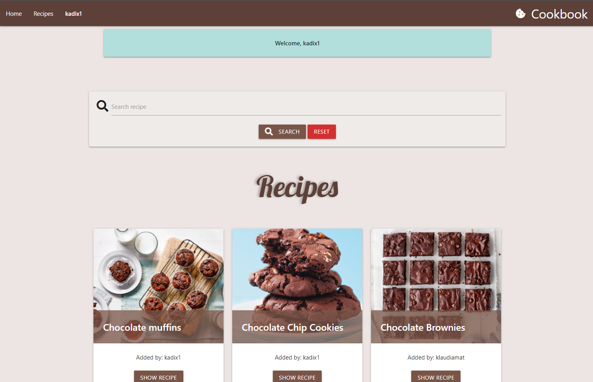

+ *As a Returning Visitor, I can log out.*
    + On the large devices I can log out by clicking my username on the navbar and select "Log Out"

        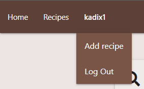
    + On the mobile devises I can log out by clicking on the hamburger button and select "Log Out"

        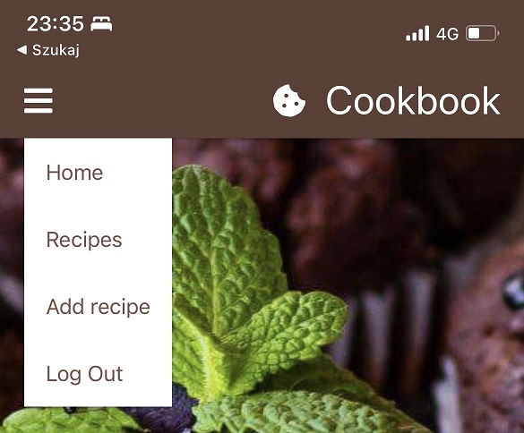
    
    + If I fill login form with incorrect values I'm redirected to login page again with message "Incorrect Username and/or Password"

        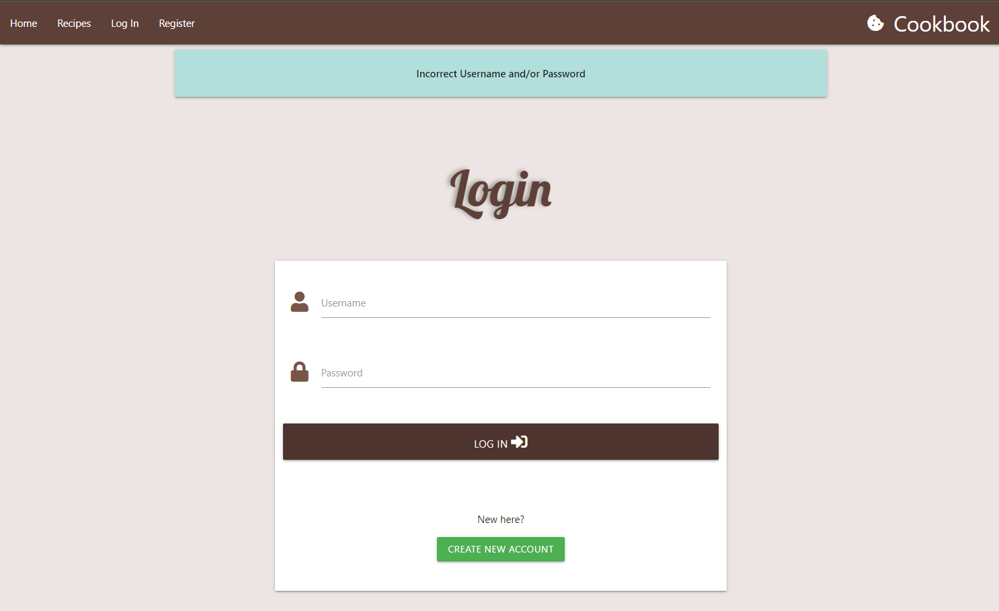

+ *As a Returning Visitor, I can create recipe so other can view it.*
    + I can add recipe while I'm log in by choosing "Add recipe" link from navigation bar and it redirect me on the page with form that I can add recipe. I need to provide title for the recipe, ingredients 1 per line, preparation method with one step per line and recipe image with URL.

        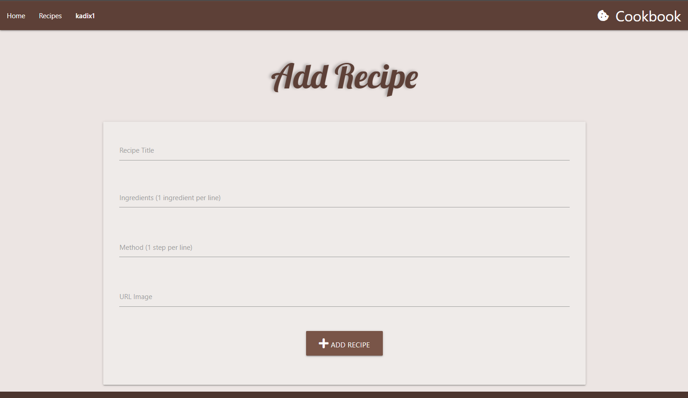
    
    + After adding the recipe it redirected me on the recipes page with message displayed "Recipe successfully added" and testing recipe added as a last recipe on the page.

        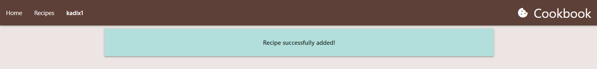

        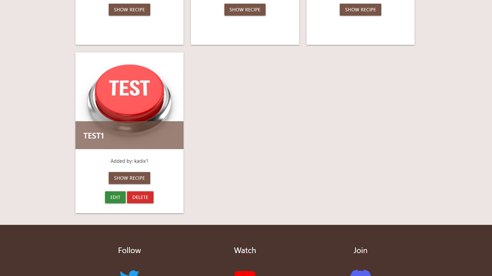

+ *As a Returning Visitor, I can edit recipe to change any mistakes.*
    + I can edit my own recipes by clicking on the green button "EDIT" on the recipes page. 

        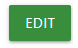

    + It redirected me on the page with form to edit selected recipe. 

        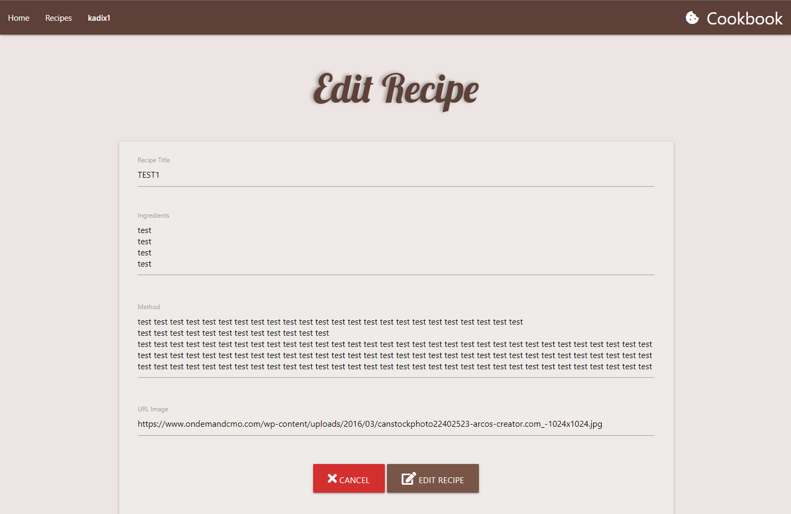

    + I can cancel the process by selecting the red button "CANCEL" and it redirects to the recipes page or I can save editng process by selecting the brown button "EDIT RECIPE" and it redirect me to the selected recipe page with message "Recipe successfully updated"

        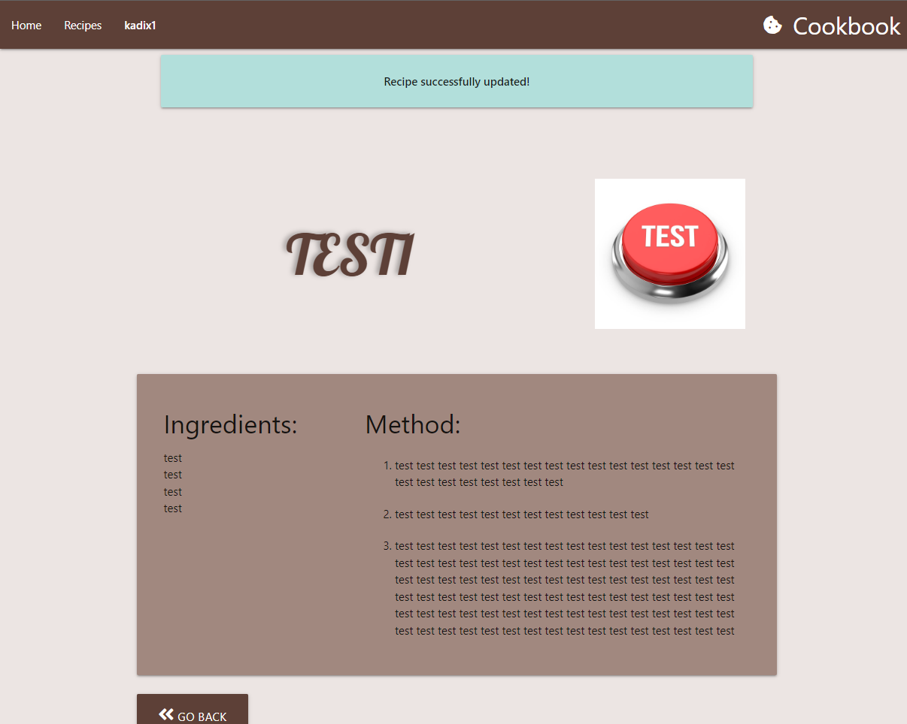

+ *As a Returning Visitor, I can delete recipe.*
    + I can delete my own recipes by selecting the red button "DELETE" on the recipes page.

        
    
    + After choosing "DELETE" button it showed up window asking me if I am sure of deleting the recipe and two optiion to choose: "NO" and "YES".

        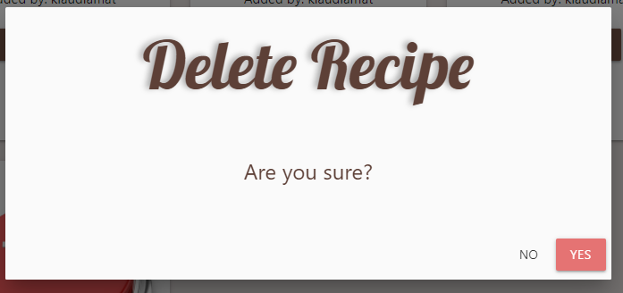
    
    + After choosing "NO" it redirects me to the recipes page.

    + After choosing "YES" it redirects me to the recipes page with message "Recipe Successfully Deleted!" and it deletes recipe from the page.

        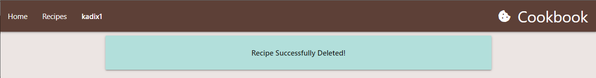

+ Admin:
+ *As a Admin, I can edit and delete all the recipes to maintain content of the page.*
    + As Admin I have access to edit and delete all the recipes on the page.

        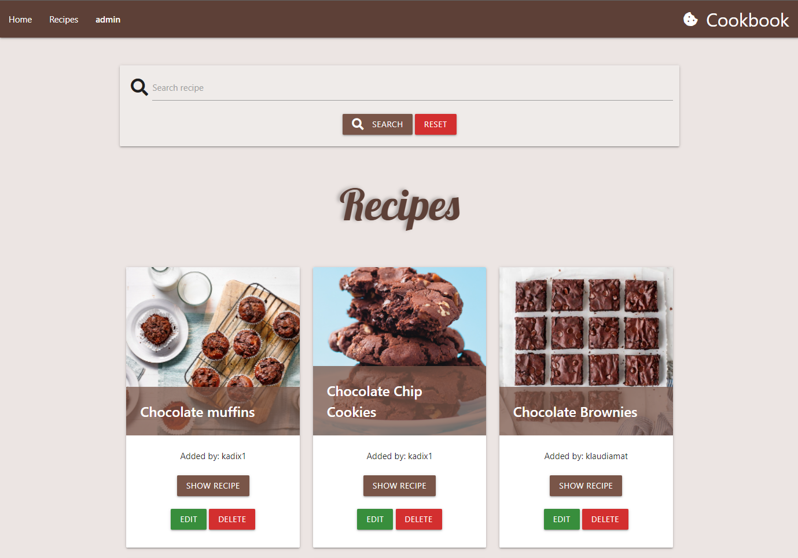

# Validators

## HTML Validator [W3C](https://validator.w3.org/nu/)

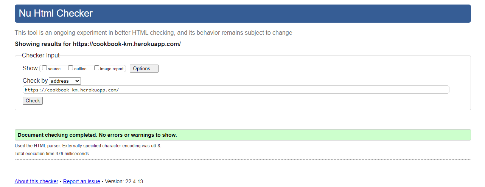

Direct links:
+ [Home](https://validator.w3.org/nu/?doc=https://cookbook-km.herokuapp.com/home)
+ [Recipes](https://validator.w3.org/nu/?doc=https://cookbook-km.herokuapp.com/get_recipes)
+ [Log In](https://validator.w3.org/nu/?doc=https://cookbook-km.herokuapp.com/login)
+ [Register](https://validator.w3.org/nu/?doc=https://cookbook-km.herokuapp.com/register)
+ [Selected Recipe](https://validator.w3.org/nu/?doc=https://cookbook-km.herokuapp.com/recipe/6258721129fb8507f067d2a6)
+ [Delete Recipe](https://validator.w3.org/nu/?doc=https://cookbook-km.herokuapp.com/delete_recipe/6258721129fb8507f067d2a6)

## CSS Validator [Jigsaw](https://jigsaw.w3.org/css-validator/)

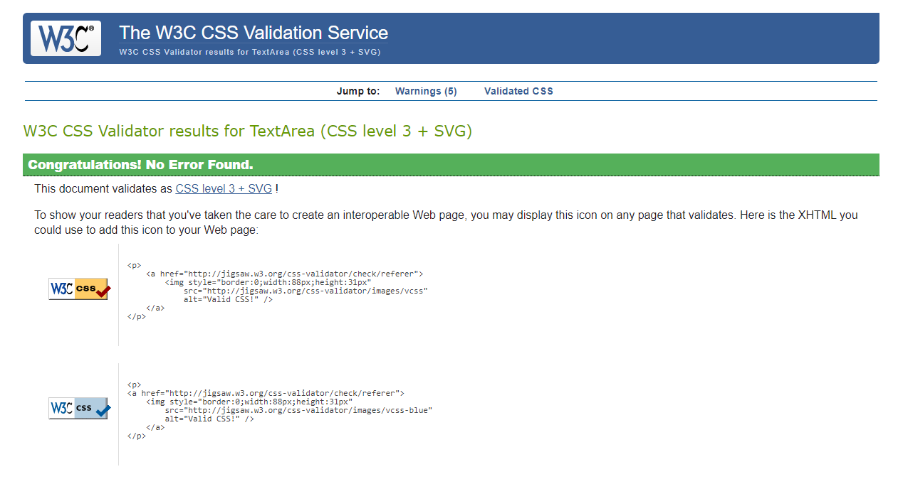

## JavaScript [JSHint](https://jshint.com/)

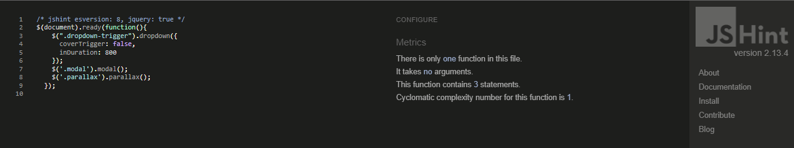

## Python [pep8online](http://pep8online.com/)

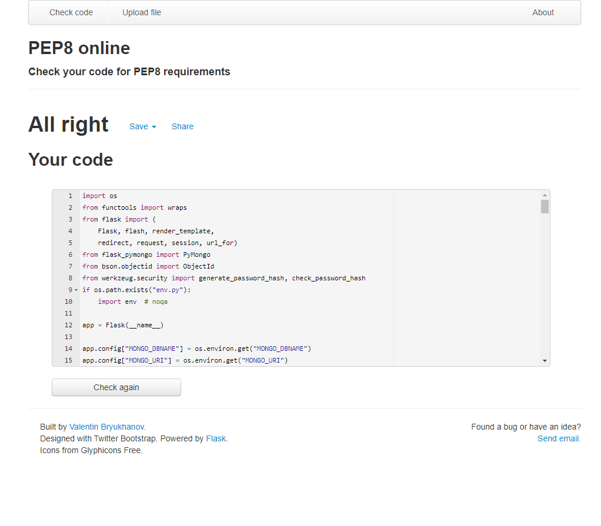