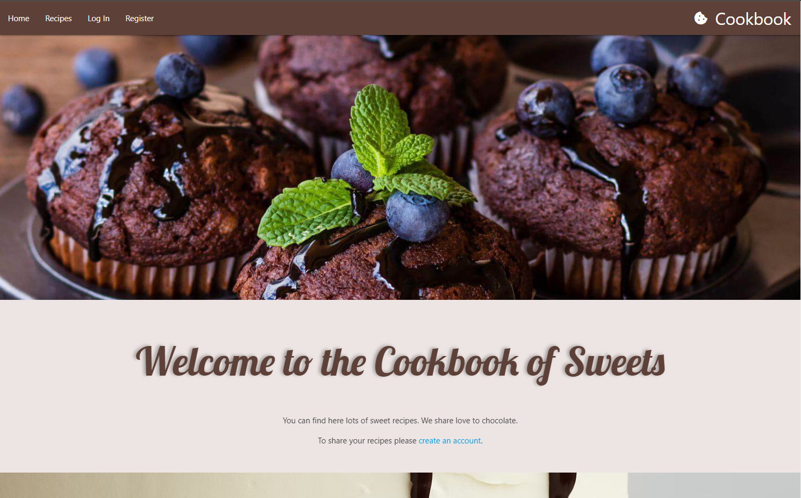
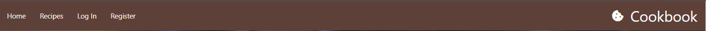
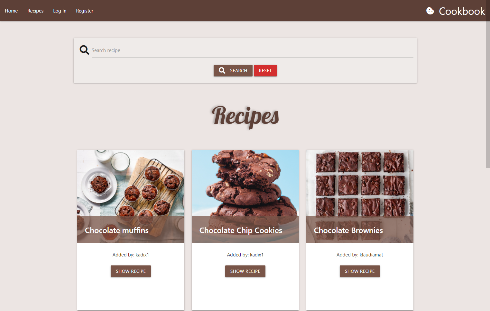
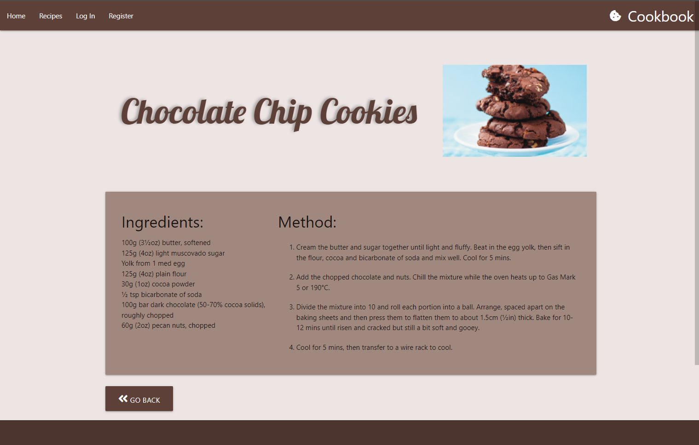
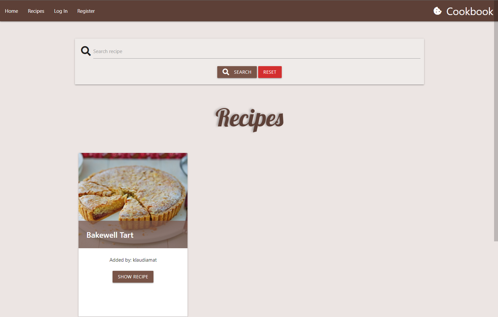
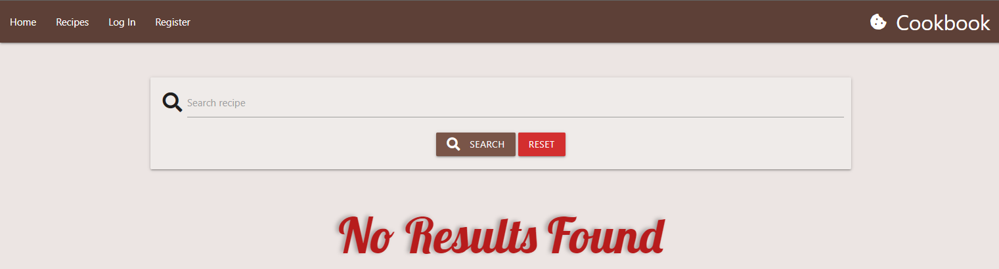
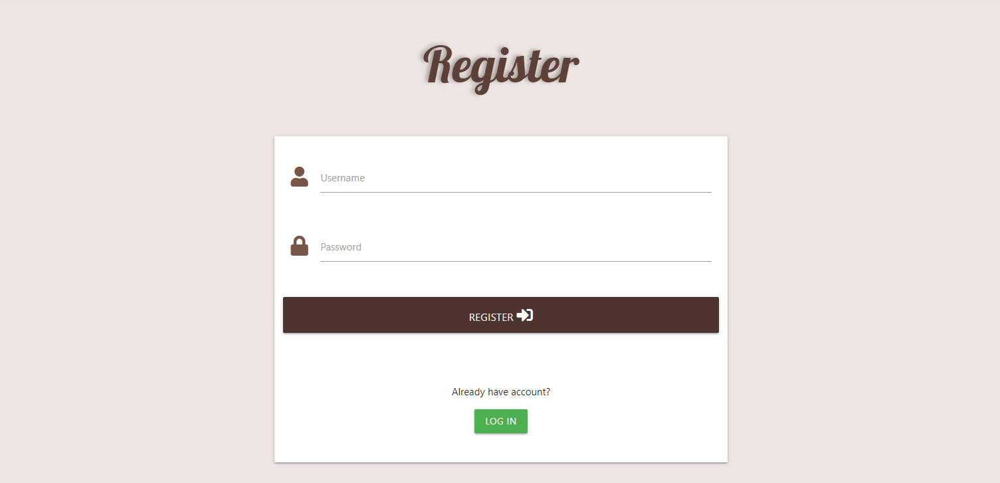
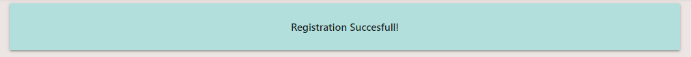
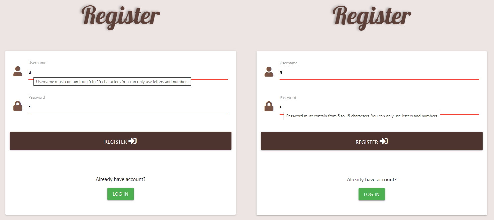
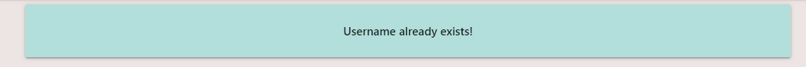

# Cookbook - Testing

# User story

## First Time Visitor:
+ *As a First Time Visitor, I can immediately understand the purpose of the webiste.*
    + The first user landing on the website is Home page. User is welcomed with chocolate muffins with blueberries and brief message explaining the site's purpose.

        

+ *As a First Time Visitor, I can easily navigate the website to find content.*
    + I can easly navigate through the site and find desirable content.

        

+ *As a First Time Visitor, I can view recipes and choose one to read.*
    + I can select *Recipes* from navbar to view all the recipes.

        

    + I can select the recipe that draws my attention. It redirects me to the selected recipe, where I can read list of ingredients and method of preparation. 
    + During testing I decided to add "GO BACK" button for more user friendly experience. 

        

+ *As a First Time Visitor, I can search for the desire recipe.*
    + I can search for recipe by title or ingriedients list item. I searched "almonds" and I got result of "Bakewell Tart". Future Improvement: displaying what user was looking for.

        

    + When there is no results found there is message displayed "No Results Found"

        

+ *As a First Time Visitor, I can register an account.*
    + I can register account just by adding username and password. 

        

    + After registration is complete I'm redirected to the Recipes Page with message "Registration Successfull"

        
    
    + I need to pass requirements to successfully register account.

        

    + I can't register account with the name already taken.

        

+ Returning Visitor:
    + As a Returning Visitor, I can log in.
    + As a Returning Visitor, I can log out.
    + As a Returning Visitor, I can create recipe so other can view it.
    + As a Returning Visitor, I can edit recipe to change any mistakes.
    + As a Returning Visitor, I can delete recipe.

+ Admin:
    + As a Admin, I can edit and delete all the recipes to maintain content of the page.